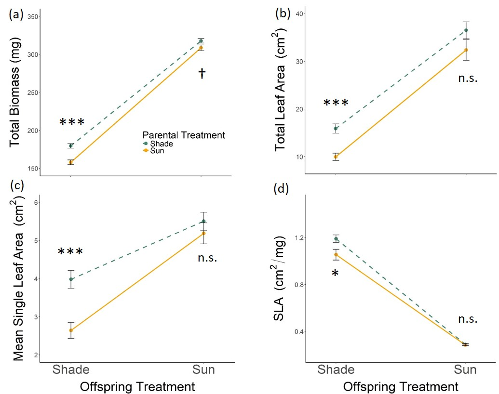

### I have a webpage!

And I can put all kinds of stuff on it!

### Add some links

[google](https://www.google.com)

internal link: [about page](about.html)

### Add images

use html



### Add code

```{r}
library(tidyverse)

tibble(
  x = 1:10,
  y = x + 2
)
```

